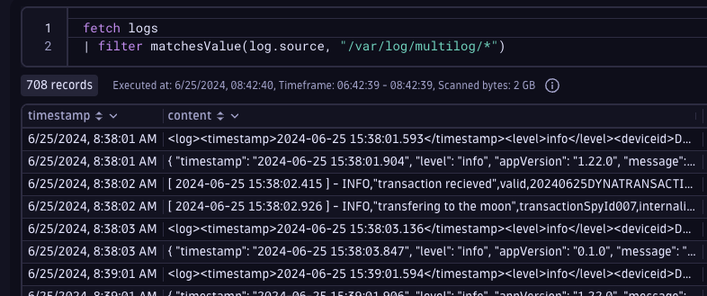

[//]: # (id: multitple-log-transaction)
[//]: # (summary: Multiple Log Transaction Review)
[//]: # (author: Kyle Harrington)
[//]: # (last update: 6/25/2024)

# Reviewing Transactions & Common Data Across Multiple Log Files
<!-- ------------------------ -->
## Overview 

### What You’ll Learn Today
In this lab we'll simulate a transaction through multiple logs and review the logs and specific transactions, via transaction IDs, through Dynatrace DQL. This lab will provide a quick setup of a cron job that with generate 6 log files in 3 different formats. This is useful for anyone looking to find commmonality of specfic values across multiple log files.

### In this lab we will 
1. Review the log simulation setup  
1. Deploy Dynatrace OneAgent 
1. Setup an cronjob on a Linux VM
1. Review the generated log entries in Dynatrace
1. Learn basic parsing syntax for Dynatrace DQL 

<!-- ------------------------ -->
## Technical Specification 
Duration: 5

### Technologies We Will Work With Today
- [Dynatrace SasS Tenant](https://www.dynatrace.com/trial/)
- [Crontab](https://man7.org/linux/man-pages/man5/crontab.5.html)
- [Bash Shell](https://en.wikipedia.org/wiki/Bash_(Unix_shell))
- [JSON](https://www.w3schools.com/js/js_json_syntax.asp)
- [XML](https://www.w3schools.com/xml/)
- [Dynatrace Query Language (DQL)](https://docs.dynatrace.com/docs/platform/grail/dynatrace-query-language)

### Simulated Transaction Flow 
The script we'll deploy will use set of templates for 

<!-- ------------------------ -->